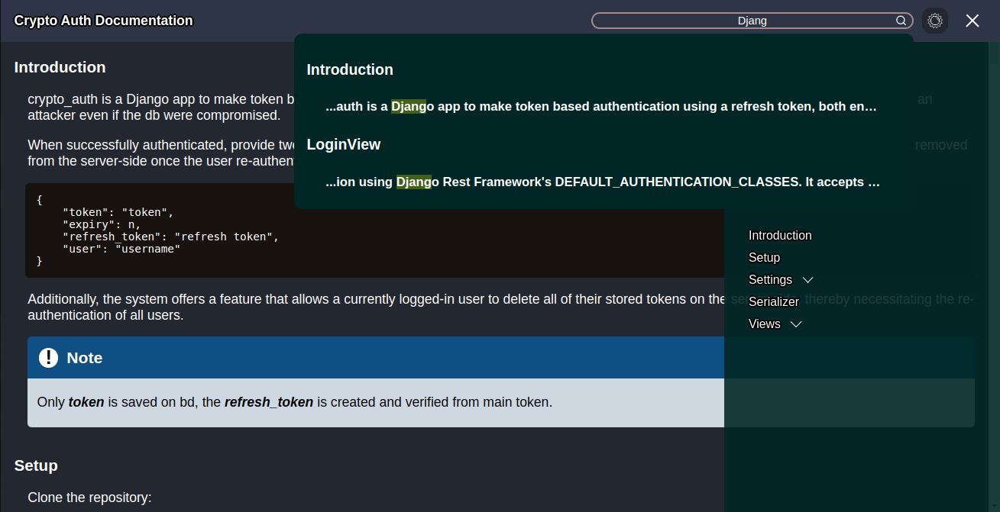

# Docs

A React Component to easily create Code Documentation



# Install

    npm i https://github.com/marceb1296/docs

# Quick Start 

    import { Docs } from "docs";
    import "docs/styles"


    const title = "Some Title"

    const content = {
        intro: {
            title: "Intro"
        }
        some: {
            title: "someTitle"
            id: "someId",
            data: [...]
        }
    }

    const sideNav = {
        exclude: {
            exclude: [
                "some"
            ]
        }
        intro: {
            childs: [
                ["someId", "someTitle"]
            ]
        }
    }
    export const YourComponent = () => {

        return (
            <Docs title={title} content={content} sideNav={sideNav} />
        )
    }


# TypeScript 

    import { Docs } from "docs";
    import { IDocs, IDocsSideNav } from "docs/types";
    import "docs/styles"


    const title: string = ...
        
    const content: IDocs= {
        intro: {
            title: "Intro"
        }
        some: {
            title: "someTitle"
            id: "someId",
            data: [...]
        }
    }

    const sideNav: IDocsSideNav = {
        exclude: {
            exclude: [
                "some"
            ]
        }
        intro: {
            childs: [
                ["someId", "someTitle"]
            ]
        }
    }
    export const YourComponent = () => {

        return (
            <Docs title={title} content={content} sideNav={sideNav} />
        )


### Docs types.

- content *
    
    ```
    IDocs {
        [key: string]: IDocsContent;
    }

    IDocsContent {
        id?: string;
        data?: (string | React.ReactNode)[];
        title: string;
    }
    ```
- navside *

    ```
    IDocsSideNav {
        [key: string]: IDocsSideNavContent;
    }

    IDocsSideNavContent {
        exclude?: string[]
        childs?: [id:string, title:string][]
    }
    ```

- title: string *


# Helpers 

## Code

    <DocsCode>
        {
            `
                print("works")
            `
        }
    <DocsCode>

### Code types

- children: React.ReactNode *

## Alerts

    <DocsAlertInfo>
        {
            <p>Some Text</p>
        }
    </DocsAlertInfo>

    <DocsAlertWarning>
        {
            <p>Some Text</p>
        }    
    </DocsAlertWarning>

    <DocsAlertDanger>
        {
            <p>Some Text</p>
        }
    </DocsAlertDanger>

### Alert types

- children: React.ReactNode *


## Tables

    
    /** Default headers 
    * Name
    * Type
    * Required
    * Description
    * Default
    **/
    <DocsTableTypes body={[
        [
            "some Name",
            "some Type"
            "true"
            "some Description"
            "some Default "
        ]
    ]} />
    
    /** Default headers
    * Code
    * Response 
    **/
    <DocsTableStatus body={[
        [
            "200",
            "Success"
        ]
    ]} />
    
    /** Default headers 
    * Endpoint
    * Method
    * Headers
    * Body
    * Example
    * Successful
    * Failed
    **/
    <DocsTableView body={[
        [
            "/",
            "Post",
            "Headers",
            "Body",
            "Some Example",
            "Success",
            "Failed"
        ]
    ]} />

### Table types

    IDocsTable {
        header?: string[]
        body: TBody[][]
    }    

    TBody = (string | React.ReactNode)


